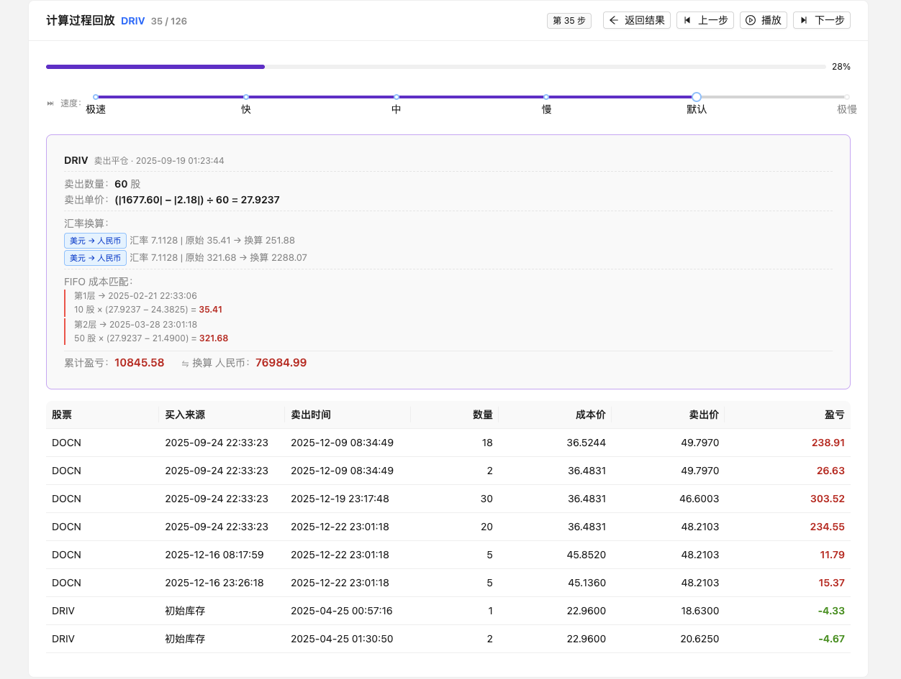

# 资本利得计算器 📊

基于 FIFO（先进先出）算法的股票交易税务计算工具，支持多币种汇率换算与股息汇总。

## 功能特性

- **FIFO 盈亏计算** — 卖出时按时间顺序匹配最早买入批次（或初始持仓），计算已实现盈亏
- **拆股/合股处理** — 自动调整 FIFO 队列中各层的数量与成本价
- **股息汇总** — 按股票+币种分组，分别统计股息收入、股息税、净股息
- **汇率换算** — 支持将盈亏与股息换算至目标币种（默认人民币），数据来源于国家外汇管理局
- **计算过程动画** — 逐笔展示 FIFO 匹配过程，支持暂停、回放、逐步翻看
- **Excel 导出** — 将盈亏明细导出为 `.xlsx` 文件

### 计算过程
逐笔展示 FIFO 匹配过程，支持暂停、回放、逐步翻看：



## 技术栈

[](https://react.dev/)
[](https://www.typescriptlang.org/)
[](https://ant.design/)
[](https://vite.dev/)
[](https://vitest.dev/)

## 快速开始

```bash
# 安装依赖
npm install

# 启动开发服务器
npm run dev

# 运行测试
npm test -- --run
```

## 使用方法

1. 准备 Excel 文件，目前只支持 “富途” 的 “年度账单.xlsx”,需要包含以下 Sheet：

| Sheet 名称 | 用途 |
|-----------|------|
| 证券-交易流水 | 买卖交易记录 |
| 证券-持仓总览 | 期初持仓（时期类型=期初） |
| 证券-资金进出 | 股息收入与股息税（类型=公司行动） |
| 证券-资产进出 | 拆股记录（备注含 SPLIT） |

2. 选择目标货币（默认人民币）
3. 上传或拖拽 Excel 文件
4. 查看计算结果，支持导出为 Excel


## 汇率数据

汇率优先从本地缓存（`data/exchangeRates.json`）查询，未找到则调用 [国家外汇管理局 API](http://m.safe.gov.cn) 获取。若当日无数据，自动使用最近有汇率的日期。

更新汇率：

```bash
npm run rates:2025   # 获取 2025 年汇率
npm run rates:all    # 获取 2024 + 2025 年汇率
```

## FIFO 计算规则

- 卖出时优先消耗最早的买入批次（或初始持仓），即**先买入的先卖出**
- 盈亏 = 卖出净收入 − 买入成本
- 初始持仓从「证券-持仓总览」Sheet 中读取，时期类型须为「期初」
- 若卖出数量超过可用持仓，超出部分记为「未匹配卖出」

## 开发

```bash
npm run dev          # 开发服务器
npm run build        # 类型检查 + 生产构建
npm test             # 测试（watch 模式）
npm run lint         # ESLint
```

## License

MIT
